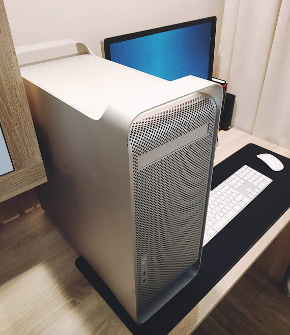
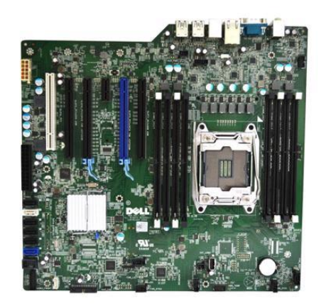
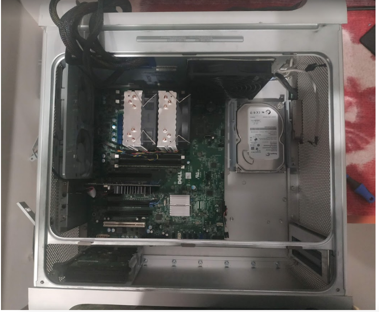
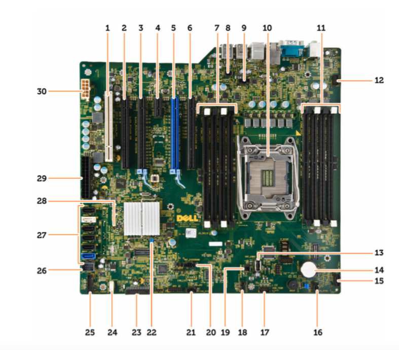
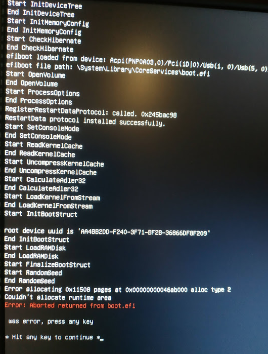
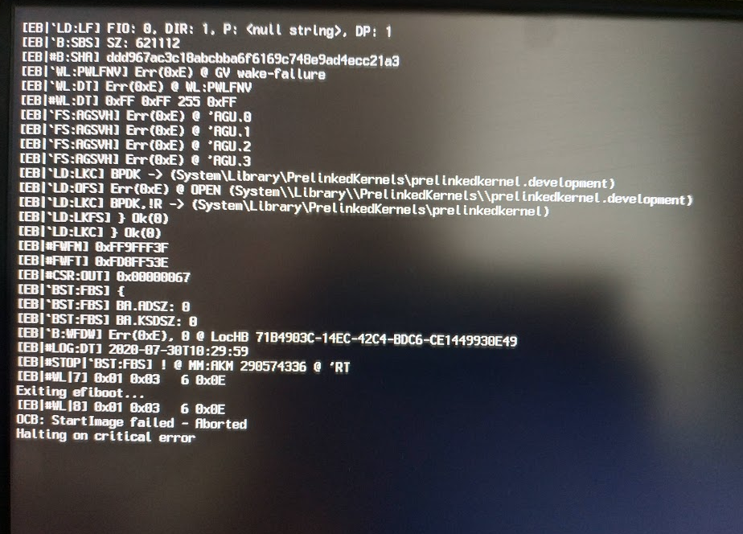

# Dell T5810 Hackintosh (Xeon E5-26xx, AMD GPU, OpenCore/Clover)

[Русская версия](src/rU.md)

OK. This branch contains the OpenCore/Clover bootloader archives for running the Mac OS 10.13-10.15. Contains some notes and observations on the installation of the OS.

I didn't use the full Dell Precision Tower 5810 workstation, but only took the motherboard from it. Thanks to its geometry, this board is perfect for installation in a PowerMac G5 case, causing minimal damage to this case.

It's worth noting that synthetic benchmarks show better performance compared to Windows 10 (not to mention Linux). The indicators are 10-15% higher both for one core and for multi-cores.

### Hackintosh Features

At the moment, my system has the following characteristics:

| Accessories | Model |
| ----------------------- | ------------------------- ------------------------------------------- |
| Motherboard | Dell T5810, C610 / 612 chip |
| CPU | Intel Xeon E5-2620 v3 |
| GPU | PowerColor Red Devil RX 570 4Gb |
| RAM | Hynix DDR4 32 Gb, 4x8 Gb 2133MHz ECC RDIMM (32 Gb) |
| WiFi/BT card | [Fenvi T919](https://aliexpress.ru/item/32778371977.html) |
| Case | Powermac G5 |
| NVME PCIEx16 adapter | [JEYI SK8-NEW](https://www.aliexpress.com/item/4000031943679.html) |
| CPU Cooling | |
| Case cooling | 2x ARCTIC F9 PWM |
| PSU | Kolink KL-850M 80 Plus Bronze 850W |

For Mac OS, the NVME disk is Silicon Power P34A80 256GB M.2 2280 PCIe 3.0 x4 NAND TLC. It has very good read (3200 Mb / s) and write (3000 Mb / s) speeds, its cost is optimal (~$50), and is also easily determined by this operating system.

Since the motherboard doesnt have a connector for NVME drives, a PCIEx16 adapter was used, inserted into the second PCIEx16 slot. This motherboard can boot from such a solution, the performance indicators are maximum. In Mac OS, this drive appears as external, but this doesn't affect system performance or stability in any way.

I highly recommend using the Fenvi T919 WiFi/BT card. It's recognized by the operating system as native. You'll have no problems connecting to WiFi network, as well as using BTs magig keyboards, magic mouse and magic trackpads.

### Whats work

* video card and all its outputs (DVI, HDMI, DP)
* TurboBoost works
* works Speed Step
* all USB ports work, 2.0 and 3.0, including the port built into the motherboard
* sound works
* WiFi works (if you use my card)
* works BT (if you use my card)
* all PCIe slots work

### What doesn't work

* sleep and hibernation
* audio from HDMI and DispayPort video cards (if you don't use VoodooHDA)
* sound problems if you enable the virtualization option in the BIOS - **VT for Direct I/O**. The audio card stops working. This issue occurs with both AppleALC and VoodooHDA. It should be noted that the sound via HDMI and DispalyPort of the video card works fine.

### Motherboard specifications

|        |      |
|--------|------|
| chipset | Intel(R) C610, C612 |
| VRM    | 6-ти фазовое |
| RAM | 8-мь DIMM слотов 2133/ 2400/ 2666 DDR4 RDIMM с поддержкой ECC, максимальный объем — 256 Гб |
| PCI Express 3.0 x16 | 2x 16 GB/s |
| PCI Express 3.0 x8 | 1x 8 GB/s |
| PCI Express 2.0 x4 | 1x 2 GB/s |
| PCI Express 2.0 x1 | 1x 0.5 GB/s |
| PCI 2.3 (32 bit, 33 MHz) | 1x 133 MB/s |
| audio chip | Realtek ALC3220 (ребрендинг ALC280) |
| Ethetnet | Intel i217 |
| SATA | 4xSATA 3.0 HDD; 2xSATA 3.0 ODD |
| USB | xUSB 3.0; 6xUSB 2.0 |

### Rear motherboard connectors

11. Line-in microphone jack
12. Serial port connector
13. USB 2.0 connectors
14. PS/2 keyboard connector
15. USB 3.0 connectors
16. Line-out connector
19. Network connector
20. PS/2 mouse connector
21. USB 3.0 connector
22. USB 2.0 connector

### Dell motherboard

1. PCI slot (slot 6)
2. PCIe x16 slot (PCIe 2.0 wired x4) (slot 5)
3. PCIe 3.0 x16 slot (slot 4)
4. PCIe 2.0 x1 slot (slot 3)
5. PCIe 3.0 x16 slot (slot 2)
6. PCIe x16 slot (PCIe 3.0 wired x8) (slot 1)
7. DIMM slots
8. Tamper switch connector
9. CPU heatsink fan connector
10. CPU socket
11. DIMM slots
12. Front panel audio jack
13. Internal USB 2.0 connector
14. Coin cell battery
15. HDD fan connector
16. System fan connector
17. HDD temperature sensor connector 19. PWR_REMOTE connector (for Teradici Host Card) 21. system fan connector
18. System fan connector
19. PWR_REMOTE connector (for Teradici Host Card) 21. system fan connector
20. Thunderbolt connector
21. System fan connector
22. Password reset jumper
23. Front panel and USB 2.0 connector
24. Built-in speaker connector
25. USB 3.0 front panel
26. Internal USB 2.0 connector for FlexBay
27. SATA connectors (HDD0-HDD3 and SATA0-1)
28. Jumper RTC_RST
29. 24-pin power connector
30. CPU power connector

## BIOS settings

This motherboard is very moody to run the Mac OS operating system. And the whole problem is in the BIOS version. I was able to start the system on BIOS version A032, but later I received a critical error on allocating memory to internal devices, and the system didn't want to start. The solution was to downgrade to version A09. With this version, the system works absolutely stably.

**WARNING!** BIOS version A09 does NOT support Broadwell (E5 v4) processor series. Support for this series starts with BIOS A11.

**WARNING!** To downgrade to BIOS A09, you must first flash BIOS A11.

There is nothing difficult about flashing the BIOS. You need to download the correct version from the [official Dell website](https://www.dell.com/support/home/ru-ua/product-support/product/precision-t5810-workstation/drivers), write the **T5810Axx.exe** file to the USB flash drive, and when the computer starts, press F12, select the BIOS update and select this file on the USB flash drive.

BIOS settings differ slightly depending on the version. For example, unlike versions A32/A33, version A09 has items that allow you to fine-tune the BIOS. I don't understand why the manufacturer removed them in subsequent versions.

### BIOS settings for A09 version to start Mac OS.

**GENERAL**

* Boot Sequence.
    * Boot List Option: **[UEFI]**
* Advanced Boot Options.
    * Enable Legacy Option ROMs **[YES]**

**System Configurations**

* Integrated NIC
    * Enable UEFI Network Stack **[DISABLE]**
* Serial Port **[DISABLE]**
* SATA Operations **[ACHI]**
* Drives **[ALL CHECK]** (HDD-0, HDD-1, HDD-2, HDD-3, ODD-0, ODD-1)
* SMART Reporting **[NO]**
* USB Configuration **[ALL CHECK]** (Enable Boot Support, Front USB, Rear USB, Internal USB, USB 3.0 XCHI)
* Audio **[YES]**
* Memory Map IO above 4GB **[NO]**
* Thunderbolt **[NO]**
* Miscellaneous Devices
    * Enable PCI Slot **[NO]**
* PCI MMIO Space Size **[SMALL]**

**VIDEO**

* Primary Video Slot **[SLOT2: VGA Compatible]**

**Security**

Все **[DISABLE]**, кроме:
* Password Change
* CPU XD Support
* OROM Keyboard Access

**Secure Boot**

* Secure Boot Enabled **[DISABLE]**
* Expert Key Management **[DISABLE]**

**Performance**

* Multi Core Support **[06]** или **[ALL]** (зависит от версии BIOS, и количества физических ядер)
* Intel SpeedStep **[YES]**
* C-States **[YES]**
* Limit CPUID Value **[NO]**
* Intel TurboBoost **[YES]**
* HyperThread control **[YES]**
* System Isochronous Mode **[NO]**
* Cache Prefetch
    * Hardware Prefetcher **[YES]**
    * Adjacent Cache Prefetcher **[YES]**
* Dell Reliable Memory Technology (RMT) **[YES]**

**Power Management** 

* AC Recovery **[Power Off]**
* Deep Sleep Control **[DISABLE]**
* Fan Speed Control **[AUTO]**
* USB Wake Support **[DISABLE]**
* Wake on LAN **[DISABLE]**
* Block Sleep (S3 State) **[NO]**

**POST Behavior** 

* Numlock LED **[DISABLE]**
* Keyboard Errors Detection **[DISABLE]**
* Fasboot **[AUTO]**

**Virtualization Support**

* Virtualization **[ENABLE]**
* VT for Direct I/O **[DISABLE]**
* Trusted Execution **[NO]**

**Maintenance**

* SERR Message [DISABLE]

**Advanced Configurations**

* ASPM **[AUTO]**
* PCIe LinkSpeed **[AUTO]**

As mentioned earlier, the motherboard is very moody, and if you get such a critical error:

* for Clover

* for OpenCore

then you have a problem with the BIOS. All drivers, patches and kext to fix this error are installed. You either configured it incorrectly or your BIOS version has problems. Check your settings or flash a different BIOS version.

[BIOS A11](bios/A11.zip)  
[BIOS A09](bios/A09.zip)
