# Dell T5810 Hackintosh (Xeon E5-26xx, AMD GPU, OpenCore/Clover, PowerMac G5 Case)

Ок. Данная ветка содержит архивы OpenCore/Clover загрузчиков, для запуска операционной системы Mac OS 10.13-10.15. Содержатся некоторые заметки и замечания по установке данной ОС.

Я не использовал полноценную рабочую станцию Dell Precision Tower 5810, а взял от нее только материнскую плату. Благодаря своей геометрии, эта плата прекрасно подходит для инсталляции в корпус от PowerMac G5, нанося этому корпусу минимальные повреждения.

Стоит заметить, что синтетические тесты показывают лучшую производительность, в сравнении с Windows 10 (не говоря уже о Linux). Показатели выше на 10-15% как по одному ядру, так и по мульти ядру.

* [Документация на Dell Precision Tower 5810](../asset/precision-t5810-workstation_owners-manual_ru-rs.pdf)
* [Гибернация и сон](../asset/Гибернация%20и%20сон.md)
* [CPU](../asset/CPU.md)
* [GPU](../asset/GPU.md)

### Характеристики Hackintosh 

На данный момент моя рабочая система имеет такие характеристики:

| Комплектующие         | Модель                                                             |
|-----------------------|--------------------------------------------------------------------|
| Материнская плата     | Dell T5810, чип C610/612                                           |
| Процессор             | Intel Xeon E5-2620 v3                                              |
| Видеокарта            | PowerColor Red Devil RX 570 4Gb                                    |
| Оперативная память    | Hynix DDR4 32 Gb, 4x8 Gb 2133MHz ECC RDIMM (32 Gb)                 |
| WiFi/BT карта         | [Fenvi T919](https://aliexpress.ru/item/32778371977.html)          |
| Корпус                | Powermac G5                                                        |
| NVME PCIEx16 адаптер  | [JEYI SK8-NEW](https://www.aliexpress.com/item/4000031943679.html) |
| Охлаждение процессора |  Arsylid CN-609-P                                   |
| Охлажение корпуса     | 2x ARCTIC F9 PWM                                                   |
| Блок питания          | Kolink KL-850M 80 Plus Bronze 850W                                 |

Для Mac OS используется NVME диск Silicon Power P34A80 256GB M.2 2280 PCIe 3.0 x4 NAND TLC. Обладает весьма неплохими показателями скорости на чтение (3200 Mb/s) и запись (3000 Mb/s), его стоимость оптимальна (~50$), а также без проблем определяется данной операционной системой.

Так как материнская плата не имеет разъема для подключения NVME дисков, был использован PCIEx16 адаптер, вставленный во второй PCIEx16 слот. Данная материнская плата умеет загружаться с такого варианта решения, показатели производительности максимальны. В Mac OS этот диск отображается как внешний, но при этом это никак не влияет на производительность или стабильность системы.

Я настоятельно рекомендую использовать WiFi/BT карту Fenvi T919. Она определяется операционной системой как родная. У вас не будет проблем с подключением к WiFi сети, а также при использовании BT клавиатур, мышек и трекпадов от Apple.

### Что работает

* видеокарта и все ее выходы (DVI, HDMI, DP)
* работает TurboBoost
* работает Speed Step
* работают все USB порты, 2.0 и 3.0, в том числе порт встроенный в материнскую плату
* работает звук
* работает WiFi (если вы используете именно мою карту)
* работает BT (если вы используете именно мою карту)
* работают все PCIe разъемы

### Что не работает

* не работает сон и гибернация
* не работает звук с HDMI и DispayPort видеокарты (если не использовать VoodooHDA)
* проблемы со звуком, если включить в BIOS опцию виртуализации - **VT for Direct I/O**. Перестает работать звуковая карта. Эта проблема наблюдается при использовании и AppleALC, и VoodooHDA. Стоит заметить, что звук через HDMI и DispalyPort видеокарты работает нормально.

### Спецификации материнской платы

|        |      |
|--------|------|
| чипсет | Intel(R) C610, C612 |
| VRM    | 6-ти фазовое |
| модули памяти | 8-мь DIMM слотов 2133/ 2400/ 2666 DDR4 RDIMM с поддержкой ECC, максимальный объем — 256 Гб |
| PCI Express 3.0 x16 | 2x 16 GB/s |
| PCI Express 3.0 x8 | 1x 8 GB/s |
| PCI Express 2.0 x4 | 1x 2 GB/s |
| PCI Express 2.0 x1 | 1x 0.5 GB/s |
| PCI 2.3 (32 bit, 33 MHz) | 1x 133 MB/s |
| звук | Realtek ALC3220 (ребрендинг ALC280) |
| Ethetnet | Intel i217 |
| SATA | 4xSATA 3.0 HDD; 2xSATA 3.0 ODD |
| USB | xUSB 3.0; 6xUSB 2.0 |

### Задние разьемы материнской платы

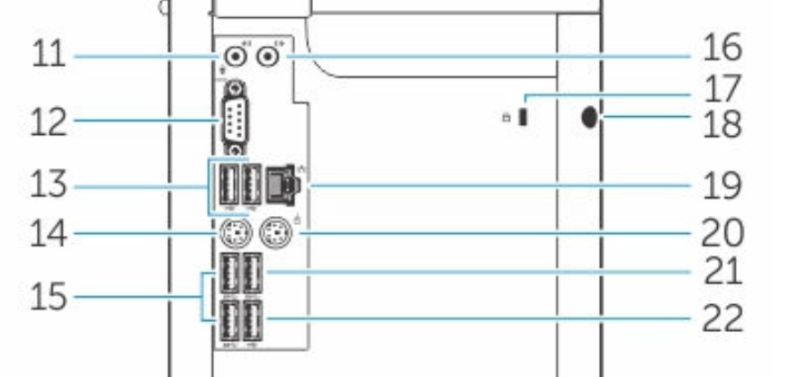

11. разъем линейного входа/разъем для микрофона
12. разъем последовательного порта
13. разъемы USB 2.0
14. разъем клавиатуры PS/2
15. разъемы USB 3.0
16. разъем линейного выхода
19. сетевой разъем
20. разъем мыши PS/2
21. разъем USB 3.0
22. разъем USB 2.0

### Материнская плата Dell

1. слот PCI (слот 6)
2. слот PCIe x16 (PCIe 2.0 с разводкой x4) (слот 5)
3. слот PCIe 3.0 x16 (слот 4)
4. слот PCIe 2.0 x1 (слот 3)
5. слот PCIe 3.0 x16 (слот 2)
6. слот PCIe x16 (PCIe 3.0 с разводкой x8) (слот 1)
7. слоты DIMM
8. разъем датчика вскрытия корпуса
9. Разъем вентилятора радиатора ЦП
10. гнездо процессора
11. слоты DIMM
12. аудиоразъем на передней панели
13. внутренний разъем USB 2.0
14. батарея типа «таблетка»
15. Разъем вентилятора жесткого диска
16. разъем системного вентилятора
17. разъем температурного датчика жесткого диска 19. Разъем PWR_REMOTE (для Teradici Host Card) 21. разъем системного вентилятора
18. разъем системного вентилятора
19. Разъем PWR_REMOTE (для Teradici Host Card) 21. разъем системного вентилятора
20. Разъем Thunderbolt
21. разъем системного вентилятора
22. перемычка сброса пароля
23. передняя панель и разъем USB 2.0
24. разъем встроенного динамика
25. разъем USB 3.0 на передней панели
26. внутренний разъем USB 2.0 для FlexBay
27. SATA-разъемы (HDD0-HDD3 и SATA0-1)
28. Перемычка RTC_RST
29. 24-контактный разъем питания
30. разъем питания ЦП

## Настройки BIOS

Данная материнская плата очень капризна для запуска операционной системы Mac OS. И вся проблема именно в версии BIOS. Мне удавалось запускать систему на версии BIOS A032, но в дальнейшем я получал критическую ошибку по выделению памяти на внутренние устройства, и система не хотела запускаться. Решением стало сделать даунгрейд до версии A09. С этой версией система работает абсолютно стабильно.

**ВНИМАНИЕ!** Версия BIOS A09 НЕ поддерживает серию процессоров Broadwell (E5 v4). Поддержка данной серии начинается с версии BIOS A11.

**ВНИМАНИЕ!** Для даунгрейда до версии BIOS A09, сначала необходимо прошить версию BIOS A11.

В перепрошивке BIOS нет ничего сложного. Необходимо скачать нужную версию с [официального сайта Dell](https://www.dell.com/support/home/ru-ua/product-support/product/precision-t5810-workstation/drivers), записать файл **T5810Axx.exe** на флешку, и при запуске компьютера нажать F12, выбрать обновление BIOS и выбрать данный файл на флешке. Процедура обновления занимает менее 5 минут. После чего зайдите в BIOS (F2) и сбросьте настройки. 

Настройки BIOS, в зависимости от версии, немного отличаются. Например, в отличии от версий A32/A33, в версии A09 есть пункты, позволяющие более тонко настроить BIOS. Не понимаю, зачем производитель их убрал в последующих версиях.

Сведения о настройках BIOS:

**GENERAL**

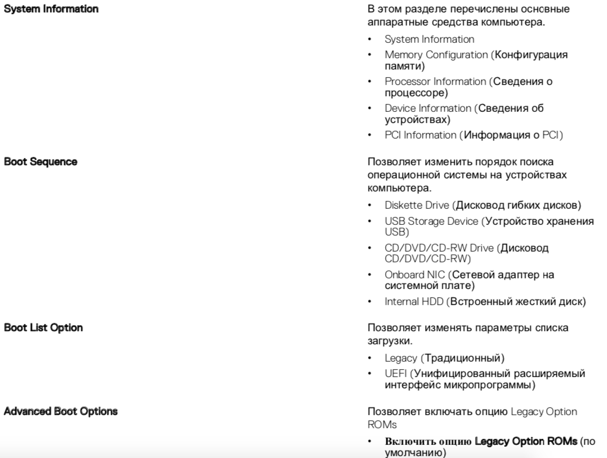

**System Configuration** (Конфигурация системы)

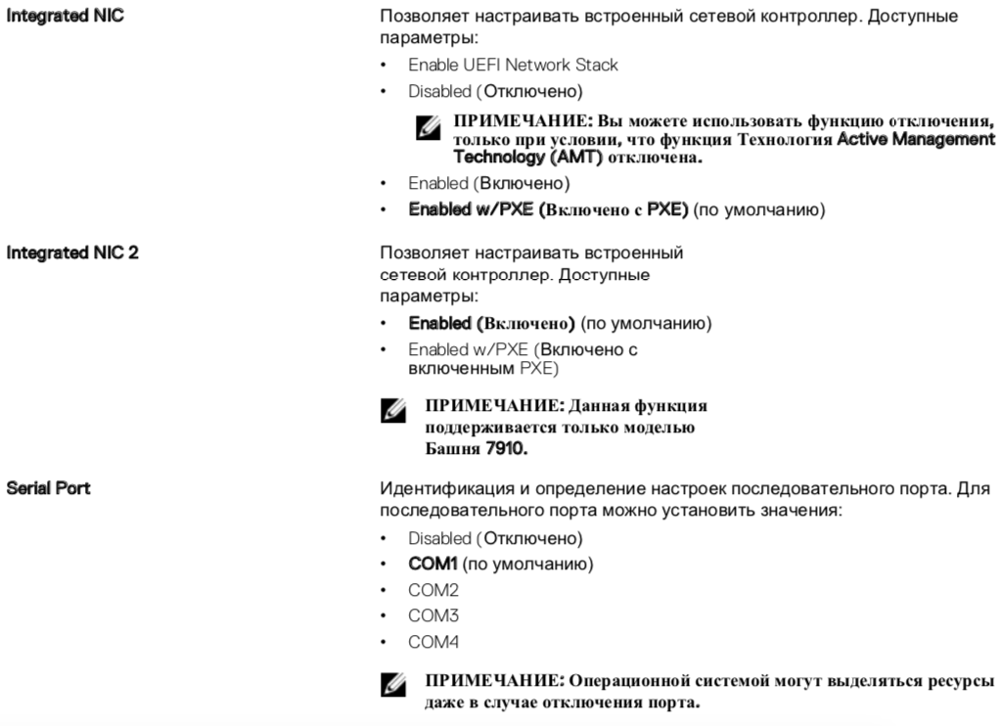
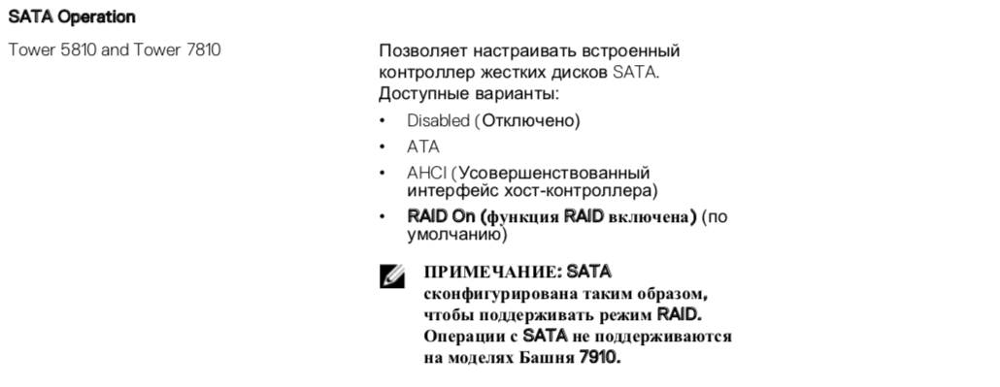
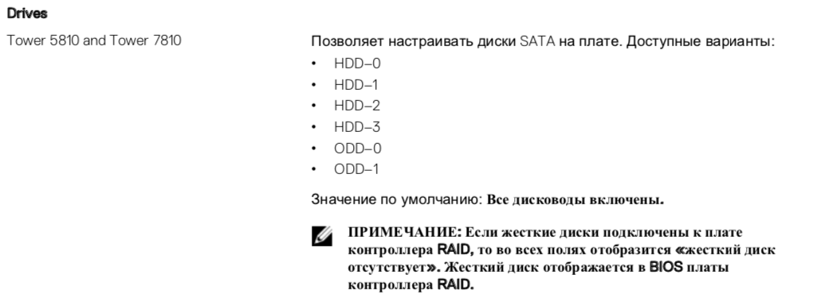
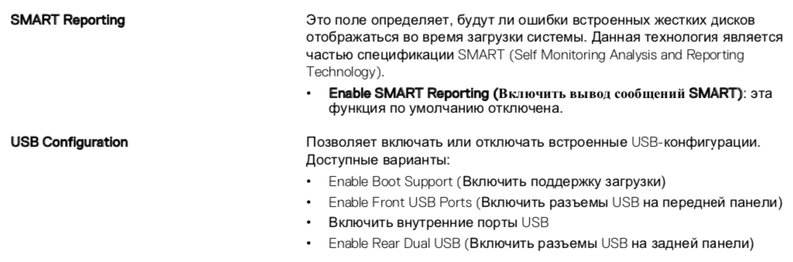

**Video**

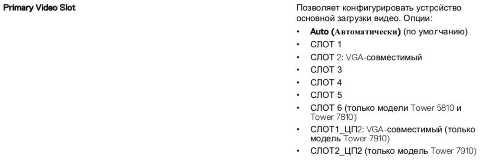

**Security (Безопасность)**

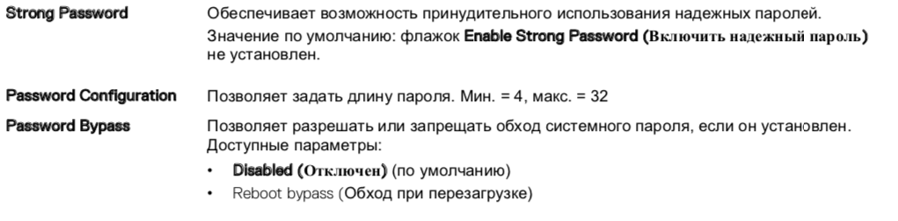
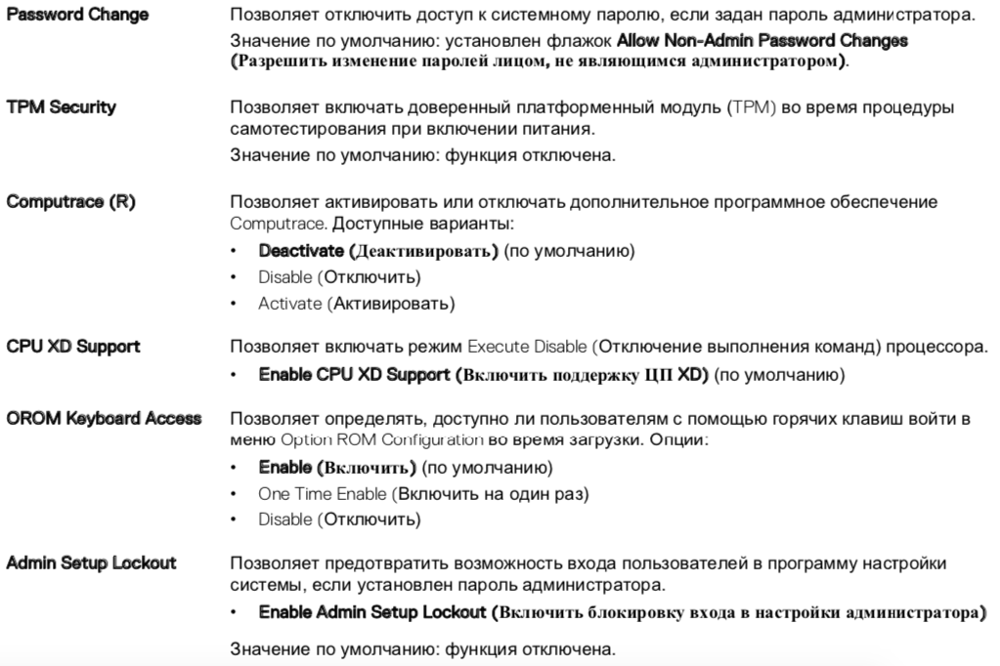

**Secure Boot**

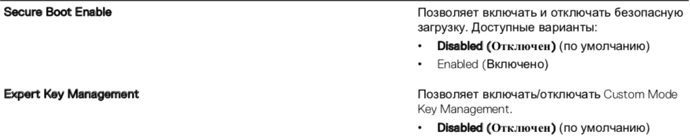

**Performance (Производительность)**

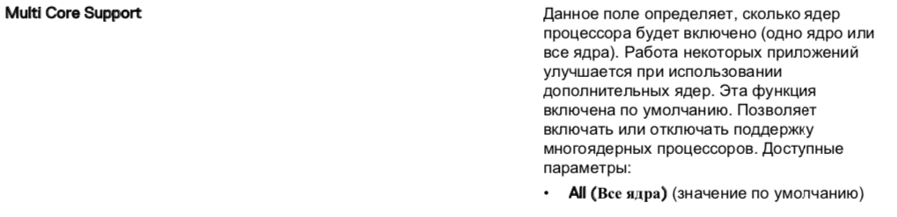
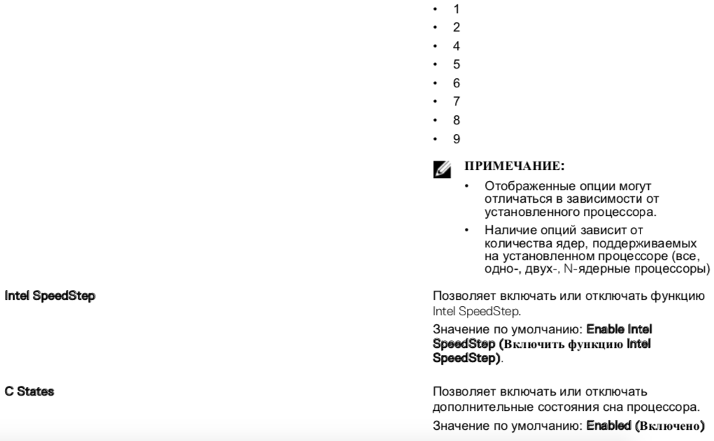
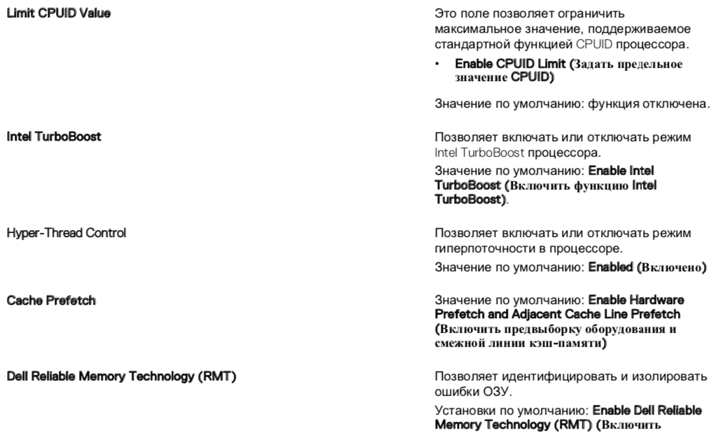

**Power Management (Управление потреблением энергии)**

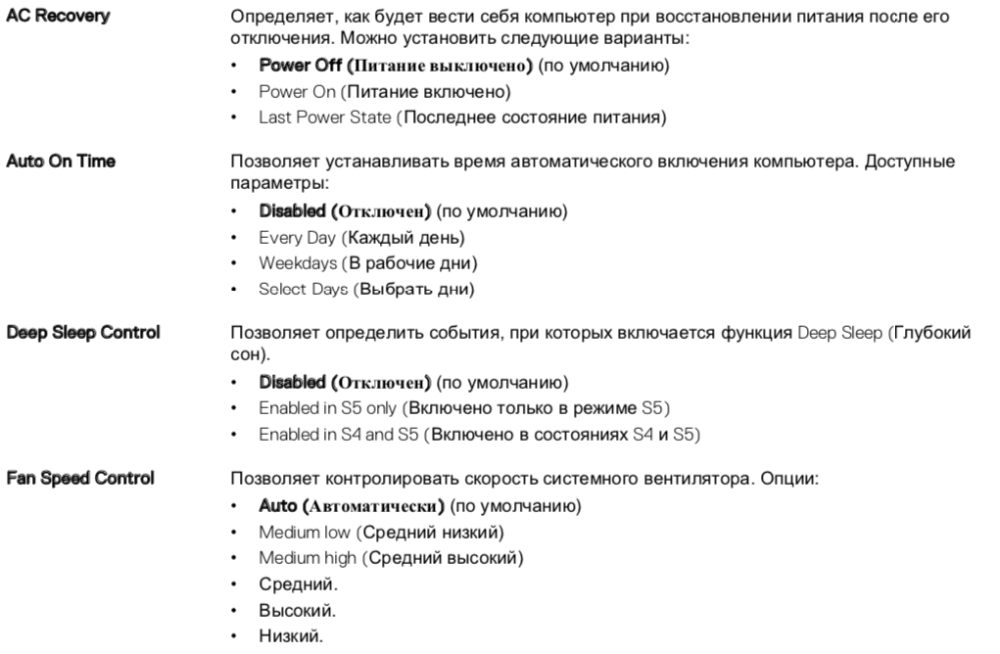
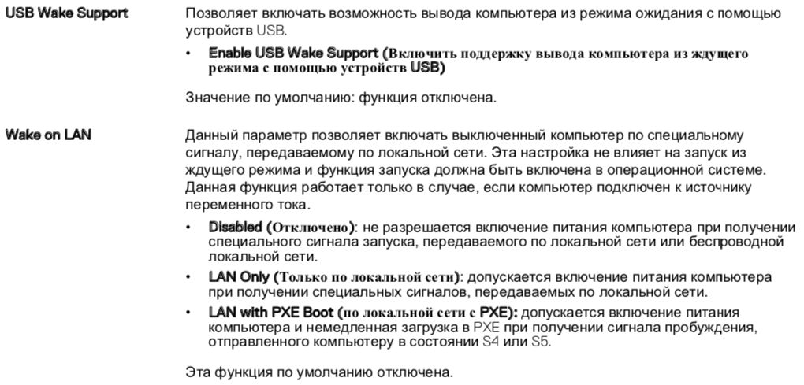

**POST Behavior (Режим работы POST)**

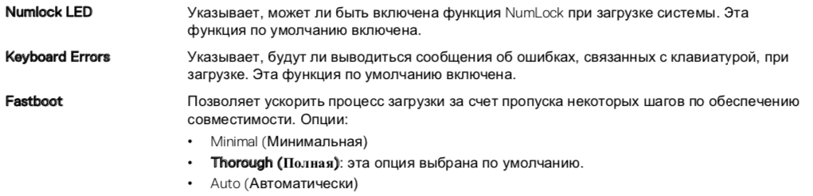

**Virtualization Support (Поддержка виртуализации)**

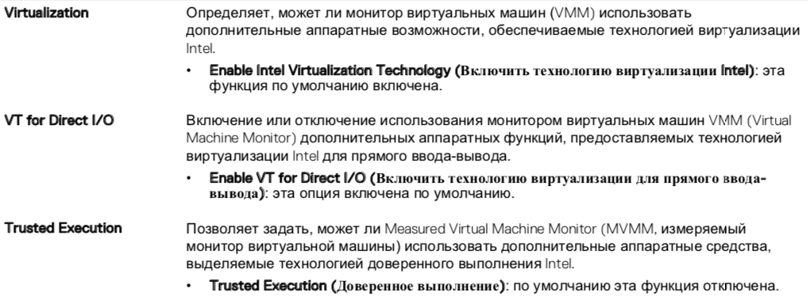

**Maintenance (Техническое обслуживание)**

**System Logs (Системные журналы)**

** Advanced Configurations (Конфигурации для техников)**

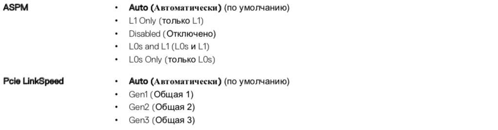

Ниже приведены настройки BIOS A09, позволяющие запустить Mac OS.

**GENERAL**

* Boot Sequence.
    * Boot List Option: **[UEFI]**
* Advanced Boot Options.
    * Enable Legacy Option ROMs **[YES]**

**System Configurations**

* Integrated NIC
    * Enable UEFI Network Stack **[DISABLE]**
* Serial Port **[DISABLE]**
* SATA Operations **[ACHI]**
* Drives **[ALL CHECK]** (HDD-0, HDD-1, HDD-2, HDD-3, ODD-0, ODD-1)
* SMART Reporting **[NO]**
* USB Configuration **[ALL CHECK]** (Enable Boot Support, Front USB, Rear USB, Internal USB, USB 3.0 XCHI)
* Audio **[YES]**
* Memory Map IO above 4GB **[NO]**
* Thunderbolt **[NO]**
* Miscellaneous Devices
    * Enable PCI Slot **[NO]**
* PCI MMIO Space Size **[SMALL]**

**VIDEO**

* Primary Video Slot **[SLOT2: VGA Compatible]**

**Security**

Все **[DISABLE]**, кроме:
* Password Change
* CPU XD Support
* OROM Keyboard Access

**Secure Boot**

* Secure Boot Enabled **[DISABLE]**
* Expert Key Management **[DISABLE]**

**Performance**

* Multi Core Support **[06]** или **[ALL]** (зависит от версии BIOS, и количества физических ядер)
* Intel SpeedStep **[YES]**
* C-States **[YES]**
* Limit CPUID Value **[NO]**
* Intel TurboBoost **[YES]**
* HyperThread control **[YES]**
* System Isochronous Mode **[NO]**
* Cache Prefetch
    * Hardware Prefetcher **[YES]**
    * Adjacent Cache Prefetcher **[YES]**
* Dell Reliable Memory Technology (RMT) **[YES]**

**Power Management** 

* AC Recovery **[Power Off]**
* Deep Sleep Control **[DISABLE]**
* Fan Speed Control **[AUTO]**
* USB Wake Support **[DISABLE]**
* Wake on LAN **[DISABLE]**
* Block Sleep (S3 State) **[NO]**

**POST Behavior** 

* Numlock LED **[DISABLE]**
* Keyboard Errors Detection **[DISABLE]**
* Fasboot **[AUTO]**

**Virtualization Support**

* Virtualization **[ENABLE]**
* VT for Direct I/O **[DISABLE]**
* Trusted Execution **[NO]**

**Maintenance**

* SERR Message [DISABLE]

**Advanced Configurations**

* ASPM **[AUTO]**
* PCIe LinkSpeed **[AUTO]**

Как говорилось ранее, материнская плата очень капризна, и если при загрузке вы получите такую критическую ошибку:

* для Clover

* для OpenCore

значит у вас проблема с BIOS. Все драйвера, патчи и kext для исправление этой ошибки установлены. Вы или его неверно настроили, или ваша версия BIOS имеет проблемы. Сверьте ваши настройки или прошейте другую версию BIOS.

[BIOS A11](bios/A11.zip)  
[BIOS A09](bios/A09.zip)

## Загрузчики

### Clover

[EFI](clover/BestEFI%20HighSierra%20UnknCPU.zip)

Данный загрузчик построен на базе Clover. Он предназначен для установки 10.13 High Sierra.

[Документация En](https://sourceforge.net/p/cloverefiboot/wiki/Home/)

[Релизы](https://github.com/CloverHackyColor/CloverBootloader/releases)

### OpenCore

[Bootloader realese](https://github.com/OreyM/Hackintosh-Dell-T5810-Xeon-E5-26xx-V3-OpenCore-PowerMac-G5/releases)

Данный загрузчик позволяет запустить Mac OS 10.15 Catalina. Система работает стабильно, как родная. Обновляется до последней версии.

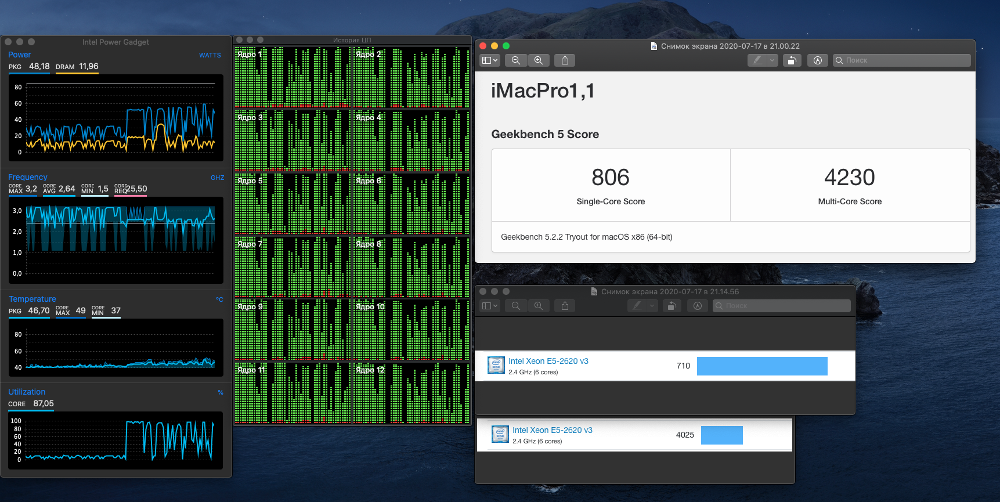

Общая производительность на уровне MacPro 2013.

Обратите внимание, что вам необходимо настроить SMBIOS для активации приложений Apple.

[Документация](https://dortania.github.io/OpenCore-Install-Guide/prerequisites.html#prerequisites)

[OpenCORE Kernel & Kext patch for X99/X299 motherboard](https://www.insanelymac.com/forum/topic/341477-open-core-kernel-kext-patch-for-x99x299-motherboard/)

## Аппаратные и программные лайфхаки

### Охлаждение корпуса

На данный момент, для выдува горячего воздуха, используется родное решение от Apple, но з заменой куллеров на 90мм ARCTIC F9 PWM. Куллера очень тихие, подключены к 4-х пиновому разъему материнской платы, как раз отвечающие за выдув. Получилось весьма эффективное решение.

### Блок питания

В данном проекте используется блок питания Kolink KL-850M. Очень неплохой блок. Было решено внедрить его в корпус от родного блока питания Powermac G5. Элементная база отлично в нем размещается.

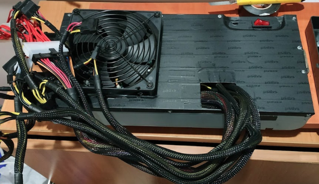

### Подключение питания материнской платы

Помимо стандартного 24 пинового конектора для материнской платы, надо подключать еще дополнительные 12В. Я их взял от 6ти пинового кабеля питания видеокарты.

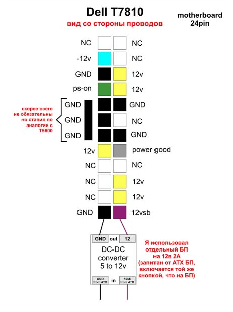

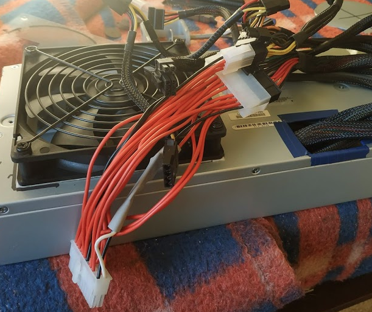

### Подключение питания процессора

Обратите внимание на то, что вход под питание процессора 10-ти пиновый. Для его запитки нам надо 8-ми пиновый кабель питания (или через переходники брать от 6-ти пинового кабеля питания видеокарты). Подключается желтыми проводами вовнутрь, разъемы разбрасываем по краям. Т.е. два средних пина на разъеме платы пусты.

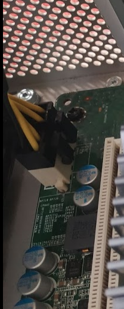

### Распиновка фронтальной панели Powermac G5

Для подключения к фронтальной панели Powermac G5 используется родной коннектор:

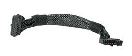

А так же стандартные кабеля IBM PC:

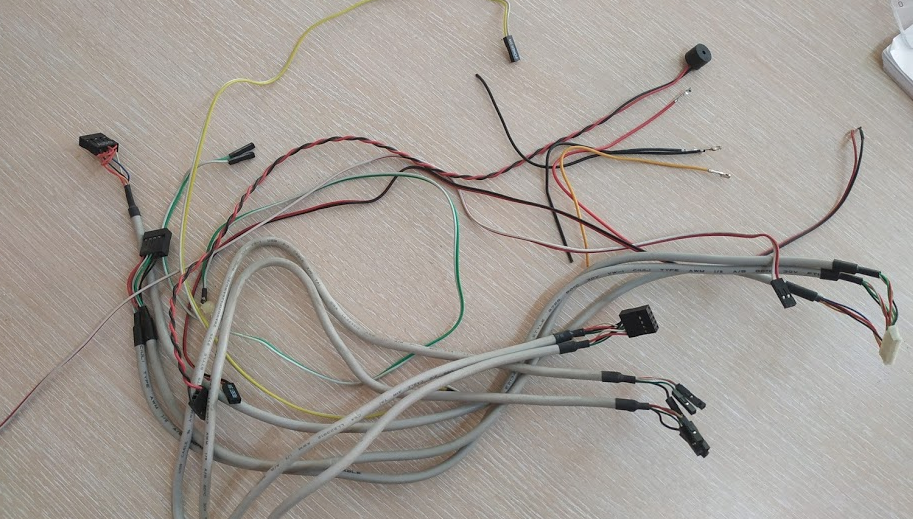

Распиновка коннектора:

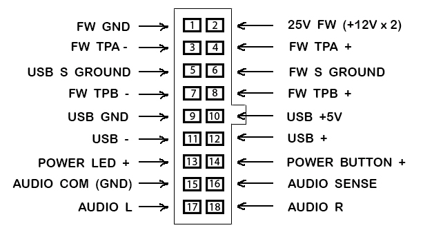

Стандартная распиновка материнской платы (НЕ Dell T5810, есть нюансы по звуку)

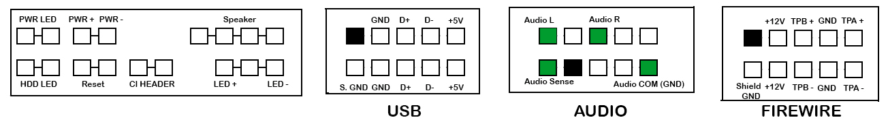

На разъеме AUDIO зеленым отмечены подписанные пины.

Подключение кнопки питания:

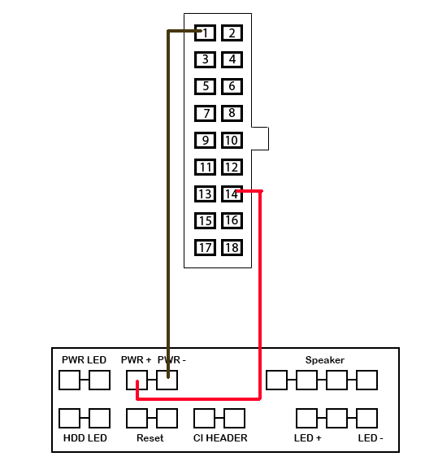

Подключение USB:

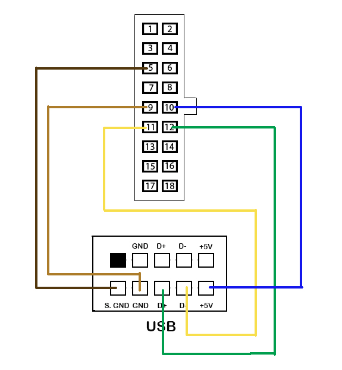

Подключение аудио-входа:

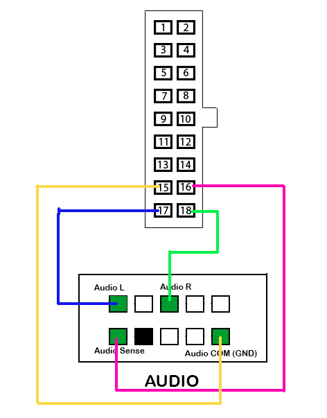

Хотя его подключение не сложнее того же USB-входа, но есть один нюанс. Apple выпендрилась, и он работает немного не так, как мы привыкли. Я имею ввиду, что когда вы подключите какое-то устройство, на него звук не пойдет. Необходимо вручную, в панели операционной системы, переключать источник аудиовыхода. По логике распиновки кабеля передней панели, за аналогичную операцию должен отвечать [16]-й пин. Но нет… Хотя скорее всего, он работает как надо, но только на материнских платах от Apple.

Подклюение FireWire:

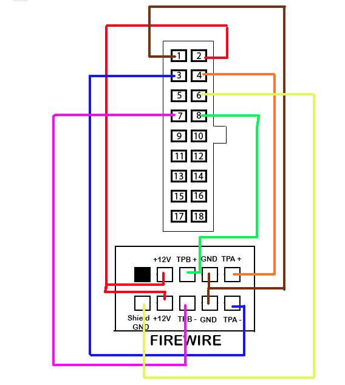

### Подключение LED индикатора состояния

Кабель LED индикатора расположен здесь, и подключается так:

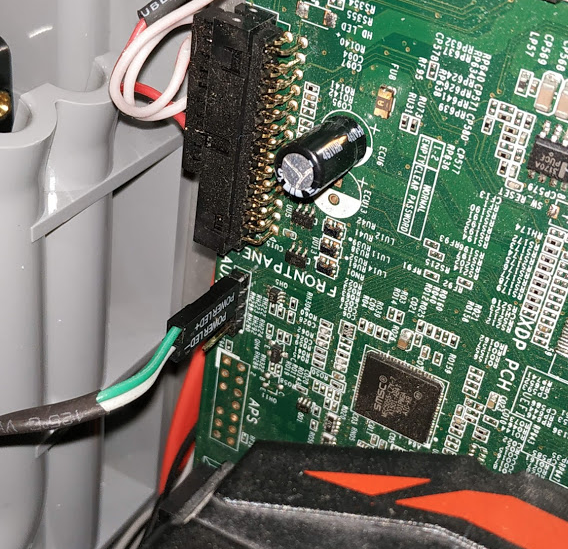

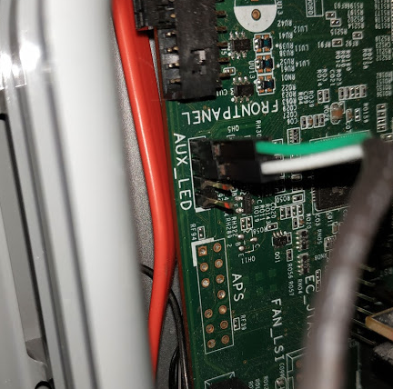

### Запуск звука

На материнской плате используется чип **Realtek ALC280**. В OpenCore есть два kext - AppleALC и VoodooHDA. 

AppleALC дает более качественный звук и это действительно так. Качество звука на уровне iMac или Macbook Pro.

К сожалению, VoodooHDA покажет посредственный звук, но достаточный для нетребовательного пользователя. На данный момент, преимущество VoodooHDA в том, что с ним работают звук с HDMI и DisplayPort видеокарты (**информация проверяется**). Я же использую AppleALC, и в OpenCore он и активирован.

Если на данный момент звук по видеовыходам вашей видеокарты для вас критичен, просто деактивируйте AppleALC в OpenCore и активируйте VoodooHDA.

Для завода звука (через AppleALC) необходим шаблон 13 (**информация проверяется**). Другие шаблоны: `3, 4, 11, 13, 15, 16, 21`.

[Инструкция OpenCore](https://dortania.github.io/OpenCore-Post-Install/universal/audio.html#fixing-audio-with-applealc)

### Подключение питания видеокарты

Если ваша видеокарта имеет внешнее питания (а все рекомендуемые карты их имеют, за исключение RX550), то скорее всего выход под питание будет расположен в верхней части видеокарты. В таком случае вы не сможете закрыть пластиковую (прозрачную) фальшпанель от Powermac G5. 

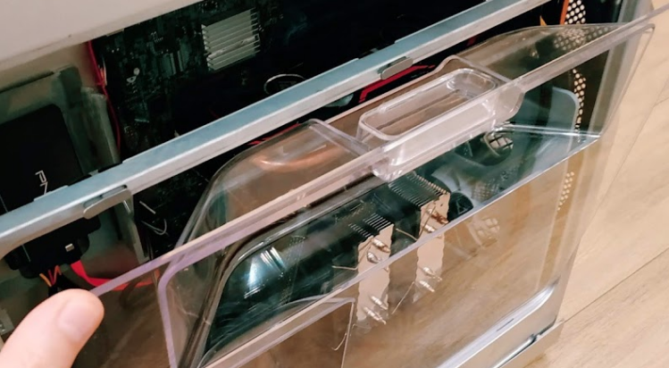

Для решения этой проблемы рекомендую использовать [данный адаптер](https://aliexpress.ru/item/4000079935335.html). 

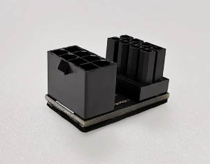

### WiFi/BT карты

Используйте только PCI карты. Не используйте USB. Ищите карты с чипсетом от Broadcomn, например BCM94360CS2 или BCM943602CS. На AliExpress искать по запросу `Hackintosh WiFi`. На данный момент, самая оптимальная Fenvi T919 - она определяется Mac OS как родная, нет необходимости устанавливать драйвера.

### Подключение BT на карте Fenvi T919

Для подключения BT данная карта требует подключение к USB. Используется стандартный ВНУТРЕННИЙ разъем, что может создать вам проблемы, если данный разъем уже используется на вашей материнской плате, или он в единственном экземпляре (как на Dell T5810). Мое решение было использовать [данный переходник](https://aliexpress.ru/item/4000130915121.html).

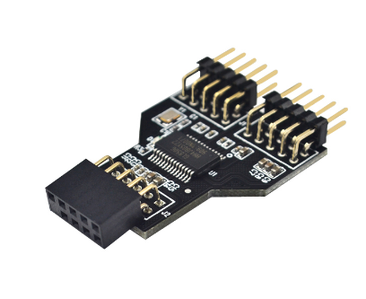

### Распиновка подключения куллера процессора

Cтоит учесть, что коннектор питания кулера 5-ти пиновый.

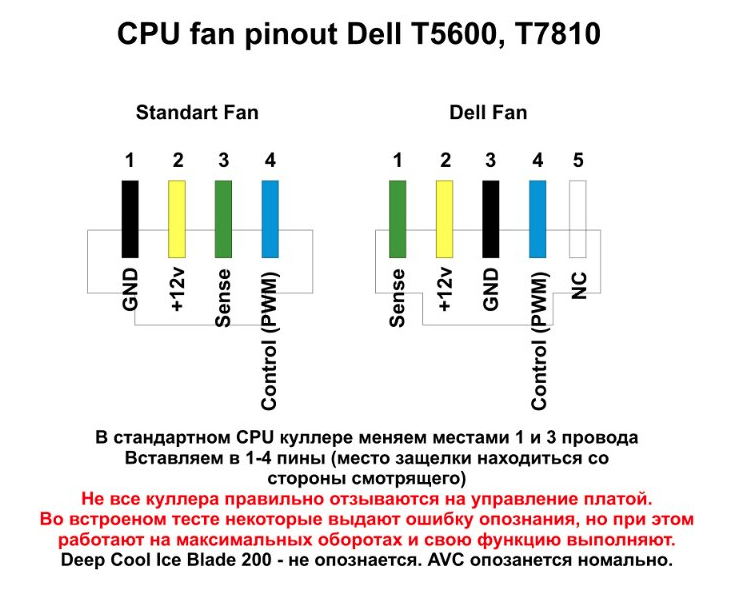

## CPU Banch

| CPU                    | Core  | PBF/MTF GHz  | Cache L3  | TDP   | Max C° | Overall | **%**    | SCore | **%**    | MCore | **%**    | Price |
|------------------------|-------|--------------|-----------|-------|--------|---------|----------|-------|----------|-------|----------|-------|
| Intel Core i7-9700     | 8/8   | 3.0 / 4.7    | 12 Mb     | 65 W  | 100°   | 8783    | **104%** | 5829  | **143%** | 30724 | **109%** | 390$  |
| Intel Core i3-8100     | 4/4   | 3.6 / 3.6    | 6 Mb      | 65 W  | 100°   | 3874    | **46%**  | 4928  | **132%** | 14714 | **48%**  | 130$  |
| AMD Ryzen 7 2700       | 8/16  | 3.2 / 4.1    | 16 Mb     | 65 W  | 95°    | 9325    | **110%** | 4687  | **129%** | 25781 | **92%**  | 175$  |
| AMD Ryzen 5 1600       | 6/12  | 3.2 / 3.6    | 16 Mb     | 65 W  | 95°    | 6817    | **81%**  | 5167  | **135%** | 24095 | **86%**  | 103$  |
| Intel Xeon E5-1620 v3  |  4/8  | 3.5 / 3.6    | 10 Mb     | 130 W | 70°    | 4034    | **48%**  | 3811  | **112%** | 14196 | **51%**  | 33$   |
| Intel Xeon E5-1630 v3  |  4/8  | 3.7 / 3.8    | 10 Mb     | 140 W | 66.2°  | 4533    | **54%**  | 4417  | **124%** | 15976 | **57%**  | 46$   |
| Intel Xeon E5-1650 v3  | 6/12  | 3.5 / 3.8    | 15 Mb     | 140 W | 66.7°  | 6446    | **77%**  | 4884  | **131%** | 24751 | **88%**  | 102$  |
| Intel Xeon E5-1660 v3  | 8/16  | 3.0 / 3.5    | 20 Mb     | 140 W | 65.9°  | 7269    | **87%**  | 4916  | **132%** | 28979 | **103%** | 235$  |
| Intel Xeon E5-1680 v3  | 8/16  | 3.2 / 3.8    | 25 Mb     | 140 W | 66.26° | 7968    | **95%**  | 5652  | **141%** | 32720 | **124%** | 290$  |
| Intel Xeon E5-2620 v3  | 6/12  | 2.4 / 3.2    | 15 Mb     | 85 W  | 72.6°  | 4750    | **57%**  | 3849  | **113%** | 19050 | **68%**  | 14$   |
| Intel Xeon E5-2630 v3  | 8/16  | 2.4 / 3.2    | 20 Mb     | 85 W  | 72.1°  | 6138    | **73%**  | 3820  | **122%** | 22642 | **81%**  | 82$   |
| Intel Xeon E5-2630L v3 | 8/16  | 1.8 / 2.9    | 20 Mb     | 55 W  | 60.4°  | 4500    | **50%**  | 3178  | **95%**  | 13994 | **50%**  | 36$   |
| Intel Xeon E5-2640 v3  | 8/16  | 2.6 / 3.4    | 20 Mb     | 90 W  | 74.3°  | 6310    | **75%**  | 3871  | **114%** | 21155 | **75%**  | 68$   |
| Intel Xeon E5-2650 v3  | 10/20 | 2.3 / 3.0    | 25 Mb     | 105 W | 78.9°  | 7261    | **86%**  | 3584  | **107%** | 23971 | **85%**  | 62$   |
| Intel Xeon E5-2660 v3  | 10/20 | 2.6 / 3.3    | 25 Mb     | 105 W | 79°    | 7938    | **95%**  | 3458  | **103%** | 24289 | **87%**  | 86$   |
| Intel Xeon E5-2670 v3  | 12/24 | 2.3 / 3.1    | 30 Mb     | 120 W | 84.5°  | 7828    | **93%**  | 3616  | **107%** | 24316 | **87%**  | 90$   |
| Intel Xeon E5-2678 v3  | 12/24 | 2.5 / 3.3    | 30 Mb     | 120 W | 66.4°  | 8396    | **100%** | 3347  | **100%** | 28074 | **100%** | 105$  |
| Intel Xeon E5-2680 v3  | 12/24 | 2.5 / 3.5    | 30 Mb     | 120 W | 82.5°  | 8965    | **106%** | 3356  | **100%** | 26862 | **96%**  | 137$  |
| Intel Xeon E5-2690 v3  | 12/24 | 2.6 / 3.5    | 30 Mb     | 135 W | 89.9°  | 9564    | **112%** | 4026  | **117%** | 30206 | **107%** | 240$  |

* PBF - Processor Base Frequency
* MTF - Max Turbo Frequency

## Итог

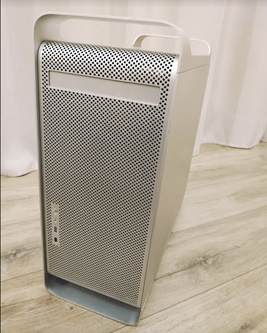

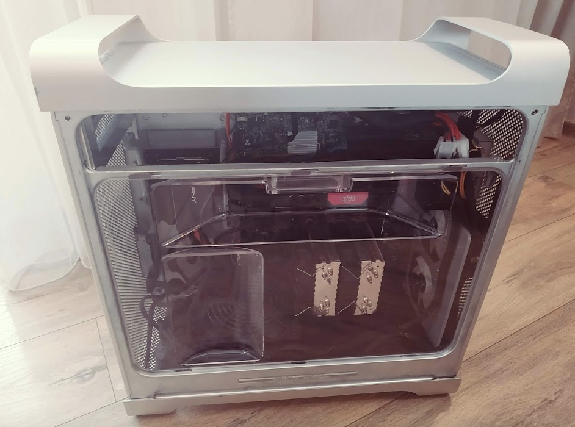

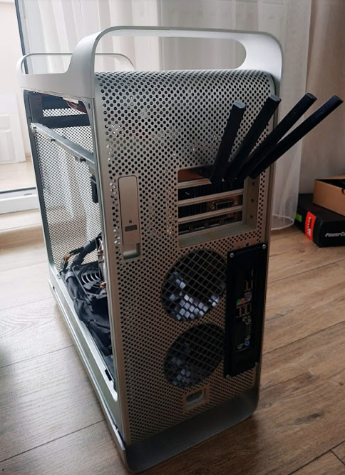

## Благодарности

Особая благодарность [sebaxakerhtc](https://4pda.ru/forum/index.php?showuser=2092640), [антико](https://4pda.ru/forum/index.php?showuser=4709617) и [lonehune](https://4pda.ru/forum/index.php?showuser=3977977). Эти парни помогли с программной частью настройки запуска и нормальной работы Mac OS.